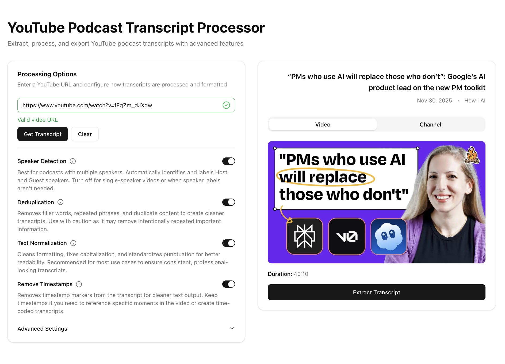
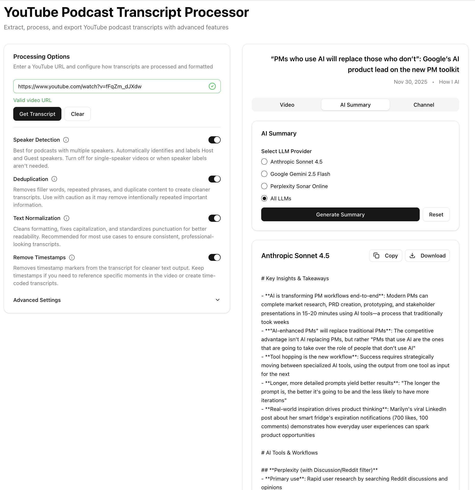
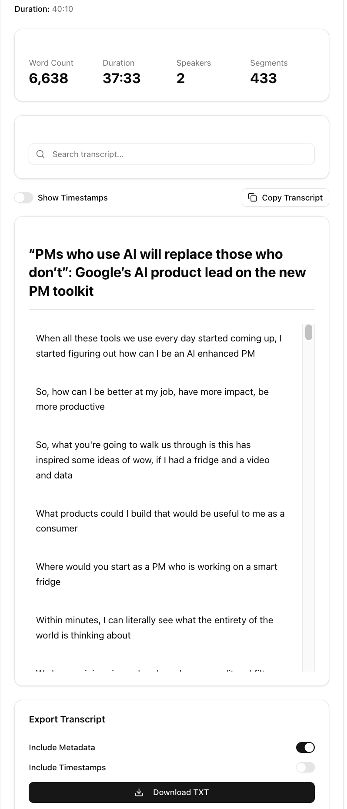

# YouTube Podcast Transcript Processor

A Next.js application for extracting, processing, and exporting YouTube podcast transcripts with advanced features including speaker detection, deduplication, and TXT export format.

## 📋 Project Documentation

- **[docs/PRD-UI.md](./docs/PRD-UI.md)** - Product Requirements Document for the User Interface
- **[docs/MILESTONES.md](./docs/MILESTONES.md)** - Development milestones with validation criteria and success metrics

## 📸 Screenshots

### Main Interface

*Main application interface with URL input and processing options*

### AI Summary

*AI-powered summary generation from multiple LLM providers*

### Transcript Viewer

*Interactive transcript viewer with search and export options*

## 🤖 AI Summary Examples

The `ai_summary` folder contains example summaries generated by different LLM providers for podcast episodes:

- **[AI Summary Folder](./ai_summary/)** - Contains summaries from Anthropic Sonnet 4.5, Google Gemini 2.5 Flash, and Perplexity Sonar Online

## ⚡ Performance Optimizations

The application includes comprehensive performance optimizations:

### Runtime Optimizations

- **Session-based caching**: Channel data is cached in memory for 5 minutes, enabling instant tab switching
- **Request deduplication**: Prevents duplicate concurrent API requests
- **Component memoization**: React.memo and useMemo prevent unnecessary re-renders
- **Optimized video enrichment**: Parallel processing for video metadata fetching
- **Tab persistence**: Channel tab stays mounted once viewed for faster subsequent access
- **Debounce & throttle**: Optimized user input handling and API calls
- **Lazy loading**: Images and heavy components loaded on demand
- **Code splitting**: Automatic bundle splitting for optimal loading

### Build Optimizations

- **Bundle optimization**: Webpack code splitting with vendor/common chunks
- **Image optimization**: AVIF and WebP format support with caching
- **Font optimization**: Font display swap for faster rendering
- **Tree shaking**: Unused code elimination
- **SWC minification**: Fast JavaScript minification

### Performance Monitoring

- **Web Vitals tracking**: FCP, LCP, FID, CLS, and TTFB monitoring
- **Performance metrics**: Page load time, DOM content loaded time
- **Memory usage tracking**: JavaScript heap size monitoring
- **Bundle size analysis**: Resource size tracking and optimization

## 🎨 User Interface

The application features a clean, modern interface with:

- **Tabbed interface**: Video tab shows preview and transcript, Channel tab shows top 10 videos
- **Real-time processing**: Visual feedback during transcript processing
- **Search functionality**: Search within transcripts with highlighting
- **Export options**: TXT format export with customizable options (metadata, timestamps)
- **Dark mode**: Full dark mode support with system preference detection
- **Responsive design**: Works seamlessly on mobile, tablet, and desktop
- **Loading skeletons**: Smooth loading states for async content
- **Smooth animations**: CSS transitions with reduced motion support
- **Micro-interactions**: Visual feedback for all user actions

## ♿ Accessibility

The application is built with accessibility in mind:

- **WCAG 2.1 AA compliant**: Meets accessibility standards
- **Keyboard navigation**: Full keyboard support for all interactions
- **Screen reader support**: ARIA labels and semantic HTML
- **Focus management**: Proper focus trapping and restoration
- **Color contrast**: Meets WCAG contrast requirements
- **Skip links**: Quick navigation for keyboard users
- **Reduced motion**: Respects user's motion preferences

## 🎯 Current Status

**Project Status**: ✅ **100% Complete** - All milestones achieved!

### Backend Logic: ✅ 100% Complete

- Transcript processing library with deduplication
- Speaker detection (Host/Guest patterns)
- TXT format export with customizable options
- Utility functions for YouTube URL handling
- yt-dlp integration for transcript fetching
- Channel and playlist video discovery
- Comprehensive error handling and edge case coverage

### Frontend UI: ✅ 100% Complete

- Complete UI with shadcn/ui components
- URL input with real-time validation
- Video preview with tabbed interface (Video/Channel tabs)
- Processing options panel with localStorage persistence
- Real-time transcript processing with progress tracking
- Interactive transcript viewer with search functionality
- Export controls for TXT format
- Channel details with top 10 videos display
- Performance optimizations (caching, memoization, request deduplication)
- Dark mode support
- Responsive design
- Accessibility improvements (WCAG 2.1 AA compliant)
- Mobile optimization with touch support
- Performance monitoring and Web Vitals tracking
- Cross-browser compatibility

## 🚀 Getting Started

### Environment Setup

Before running the development server, you need to configure your environment variables. Create a `.env.local` file in the root directory:

```bash
# Copy the example and add your API keys
cp .env.example .env.local  # If .env.example exists
# Or create .env.local manually
```

Add your API keys to `.env.local`:

```env
# Anthropic API Configuration (Required for AI Summary feature)
ANTHROPIC_API_KEY=sk-ant-your-api-key-here
ANTHROPIC_MODEL=claude-sonnet-4-20250514
ANTHROPIC_MODEL_NAME=Anthropic Sonnet 4.5

# Google Gemini API Configuration (Optional)
GOOGLE_GEMINI_API_KEY=your_google_gemini_api_key_here
GOOGLE_GEMINI_MODEL=gemini-2.5-flash
GOOGLE_GEMINI_MODEL_NAME=Google Gemini 2.5 Flash

# Perplexity API Configuration (Optional)
PERPLEXITY_API_KEY=your_perplexity_api_key_here
PERPLEXITY_MODEL=sonar-online
PERPLEXITY_MODEL_NAME=Perplexity Sonar Online
```

**Note**: The `ANTHROPIC_API_KEY` is required if you want to use the AI Summary feature. You can get your API key from [Anthropic's Console](https://console.anthropic.com/).

For more details, see [docs/ENV_VARIABLES.md](./docs/ENV_VARIABLES.md).

### Running the Development Server

```bash
npm run dev
# or
yarn dev
# or
pnpm dev
# or
bun dev
```

Open [http://localhost:3000](http://localhost:3000) with your browser to see the result.

You can start editing the page by modifying `app/page.tsx`. The page auto-updates as you edit the file.

This project uses [`next/font`](https://nextjs.org/docs/app/building-your-application/optimizing/fonts) to automatically optimize and load [Geist](https://vercel.com/font), a new font family for Vercel.

## 🛠️ Tech Stack

- **Framework**: Next.js 15+ (App Router)
- **Language**: TypeScript 5+
- **Styling**: Tailwind CSS 4+
- **UI Components**: shadcn/ui (to be installed)
- **React**: 19+

## 📦 Features

### ✅ Core Features

- ✅ YouTube URL validation and parsing (multiple formats)
- ✅ Transcript processing with deduplication
- ✅ Automatic speaker detection (Host/Guest)
- ✅ TXT format export with customizable options
- ✅ Single video transcript processing
- ✅ Channel and playlist video browsing
- ✅ Interactive transcript viewer with search
- ✅ Real-time processing options with persistence
- ✅ Channel information display with top 10 videos
- ✅ AI-powered transcript summaries (Anthropic, Google Gemini, Perplexity)

### ✅ Performance & Optimization

- ✅ Session-based caching for instant tab switching
- ✅ Request deduplication to prevent duplicate API calls
- ✅ Component memoization (React.memo, useMemo, useCallback)
- ✅ Code splitting and lazy loading
- ✅ Bundle optimization and tree shaking
- ✅ Image optimization (AVIF, WebP)
- ✅ Performance monitoring (Web Vitals tracking)
- ✅ Debounce and throttle utilities

### ✅ User Experience

- ✅ Dark mode support with system preference detection
- ✅ Responsive mobile design with touch optimization
- ✅ Loading skeletons for smooth loading states
- ✅ Smooth animations with reduced motion support
- ✅ Micro-interactions and visual feedback
- ✅ Error handling with recovery options
- ✅ Empty states with helpful messages
- ✅ Comprehensive error boundaries

### ✅ Accessibility

- ✅ WCAG 2.1 AA compliance
- ✅ Full keyboard navigation support
- ✅ Screen reader optimization
- ✅ ARIA labels on all interactive elements
- ✅ Focus management and trapping
- ✅ Color contrast compliance
- ✅ Skip links for quick navigation

### 🚧 Future Enhancements

- Transcript history and local storage
- Advanced speaker identification (ML-based)
- Transcript summarization
- Multi-language support
- Browser extension

## 📖 Development Milestones

See [docs/MILESTONES.md](./docs/MILESTONES.md) for detailed development plan. All 9 milestones are now complete:

1. ✅ Foundation & Setup
2. ✅ URL Input & Validation
3. ✅ Transcript Fetching & API Integration
4. ✅ Processing Options UI
5. ✅ Processing Integration
6. ✅ Transcript Viewer
7. ✅ Export Functionality
8. ✅ Error Handling & Edge Cases
9. ✅ Polish & Optimization

**Status**: 🎉 **100% Complete** - All milestones achieved with comprehensive testing!

## 🏗️ Project Structure

```text
src/
├── app/                    # Next.js App Router
│   ├── api/               # API routes
│   │   ├── transcript/    # Transcript fetching endpoints
│   │   ├── channel/       # Channel information endpoint
│   │   └── discover/      # Video discovery endpoint
│   ├── layout.tsx         # Root layout with theme provider
│   └── page.tsx           # Home page with main UI
├── components/            # React components
│   ├── ui/               # shadcn/ui components
│   │   └── skeleton.tsx  # Loading skeleton component
│   ├── layout/           # Layout components (Header, Footer, Container)
│   ├── features/         # Feature-specific components
│   │   ├── VideoPreview.tsx      # Video metadata and tabs
│   │   ├── ChannelDetails.tsx    # Channel info and top videos
│   │   ├── TranscriptViewer.tsx  # Transcript display with search
│   │   ├── ProcessingOptions.tsx # Processing configuration
│   │   ├── ExportControls.tsx    # Export functionality
│   │   ├── ErrorDisplay.tsx      # Error display component
│   │   ├── EmptyState.tsx        # Empty state components
│   │   └── RetryButton.tsx      # Retry action component
│   └── ErrorBoundary.tsx # React error boundary
├── lib/                   # Utility functions
│   ├── transcript-processor.ts  # Processing logic
│   ├── ytdlp-service.ts         # yt-dlp integration
│   ├── api-client.ts            # API client with caching
│   ├── channel-cache.ts          # Session-based caching
│   ├── youtube-validator.ts    # URL validation
│   ├── performance-utils.ts     # Performance utilities
│   ├── accessibility-utils.ts   # Accessibility helpers
│   ├── mobile-utils.ts          # Mobile optimization
│   ├── performance-monitor.ts   # Performance monitoring
│   ├── animations.ts            # Animation utilities
│   └── utils.ts                # General utilities
├── hooks/                 # Custom React hooks
│   ├── useChannelData.ts        # Channel data with caching
│   ├── useTranscriptProcessing.ts # Transcript processing
│   ├── useProcessingOptions.ts  # Options management
│   └── useUrlValidation.ts      # URL validation
└── types/                 # TypeScript definitions
    └── index.ts          # Type definitions
```

## 🧪 Testing

The project includes comprehensive testing:

- **Unit Tests**: Vitest + React Testing Library (80%+ coverage)
- **Integration Tests**: API routes and utility functions
- **E2E Tests**: Playwright for user flows and cross-browser testing
- **Performance Tests**: Web Vitals and bundle size monitoring
- **Accessibility Tests**: WCAG compliance and keyboard navigation

Run tests:

```bash
npm test              # Unit tests
npm run test:coverage # With coverage report
npm run test:e2e      # E2E tests
```

## 📚 Documentation

- **[docs/PRD-UI.md](./docs/PRD-UI.md)** - Product Requirements Document
- **[docs/MILESTONES.md](./docs/MILESTONES.md)** - Development milestones and progress
- **[docs/ENV_VARIABLES.md](./docs/ENV_VARIABLES.md)** - Environment variable configuration
- **[docs/API_VERIFICATION.md](./docs/API_VERIFICATION.md)** - API implementation verification
- **[docs/DEBUG_LOGGING_DOCUMENTATION.md](./docs/DEBUG_LOGGING_DOCUMENTATION.md)** - Debug logging guide
- **[docs/prompt.md](./docs/prompt.md)** - AI summary prompt template (loaded at runtime for LLM API calls)

## 📝 Learn More

- [Next.js Documentation](https://nextjs.org/docs)
- [Tailwind CSS Documentation](https://tailwindcss.com/docs)
- [shadcn/ui Documentation](https://ui.shadcn.com)
- [Playwright Documentation](https://playwright.dev)
- [Vitest Documentation](https://vitest.dev)

## 🚢 Deployment

### Deploy on Vercel

The easiest way to deploy your Next.js app is to use the [Vercel Platform](https://vercel.com/new?utm_medium=default-template&filter=next.js&utm_source=create-next-app&utm_campaign=create-next-app-readme).

### Pre-Deployment Checklist

- [ ] Set all required environment variables in Vercel dashboard
- [ ] Ensure `yt-dlp` binary is available in deployment environment
- [ ] Verify API keys are configured correctly
- [ ] Run `npm run build` locally to verify build succeeds
- [ ] Run `npm run test:e2e` to verify E2E tests pass
- [ ] Check bundle size meets performance targets (< 1MB initial JS)

### Performance Targets

- ✅ Page load time < 2 seconds
- ✅ Lighthouse Performance score > 90
- ✅ Lighthouse Accessibility score > 95
- ✅ Bundle size < 1MB initial JavaScript
- ✅ Memory usage < 100MB typical operations

## 🎉 Project Completion

This project has successfully completed all 9 development milestones with:

- ✅ Comprehensive error handling and edge case coverage
- ✅ Full accessibility compliance (WCAG 2.1 AA)
- ✅ Performance optimizations and monitoring
- ✅ Mobile-first responsive design
- ✅ Cross-browser compatibility
- ✅ Extensive test coverage (unit, integration, E2E)

**Ready for production deployment!** 🚀
